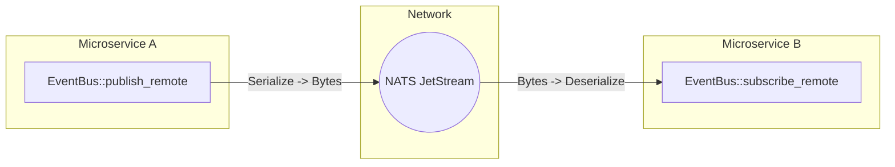

<div align="center">
  <h1>🚀 tokio-events</h1>
  <p><strong>A zero-lock, high-throughput, enterprise-grade event bus for Rust.</strong></p>
  
  [](https://crates.io/crates/tokio-events)
  [](https://docs.rs/tokio-events)
  [](https://github.com/your-org/tokio-events/actions)
  [](https://crates.io/crates/tokio-events)
  [](LICENSE)
</div>

---

`tokio-events` is a modern, type-safe, asynchronous event bus built natively on `tokio`. It scales seamlessly from a blazing-fast in-memory pub/sub channel in a monolith, all the way to a strictly-typed, distributed, persistent event architecture across microservices.

Go from zero to **2,000,000 events/sec** in 5 lines of code.

## ✨ Why tokio-events?

- **⚡ Lock-Free Routing (RCU)**: Event publishing is completely lock-free. By utilizing the `arc-swap` Read-Copy-Update pattern, `tokio-events` eliminates Cache Line Bouncing, allowing you to publish millions of events per second across all CPU cores without contention.
- **🛡️ Exactly-Once Delivery (Idempotency)**: Natively attach `idempotency_key`s to your events. The embedded `redb` storage engine guarantees duplicate events are filtered instantly before reaching subscribers.
- **💾 Disk Persistence & Group Commit**: (Optional) Never lose an event. Un-ACK'd events are stored on disk. The engine uses Group Commit batching to drain thousands of events into a single SSD physical flush, resulting in a **~14x increase** in disk write throughput.
- **♻️ Built-In Dead Letter Queues (DLQ)**: Permanently failed events are automatically captured in a dedicated `DLQ_TABLE` for easy inspection and simple one-line `.replay_dlq().await` recovery.
- **🌍 Microservices Ready**: Built-in support for NATS JetStream distributed routing and strict schema enforcement via `prost` Protobuf.

---

## 🚀 Quick Start (In-Memory JSON)

Add the dependency to your `Cargo.toml`:
```toml
[dependencies]
tokio-events = "0.4.0"
tokio = { version = "1.0", features = ["full"] }
```

Define an event, create the bus, and publish!

```rust
use tokio_events::prelude::*;

// 1. Define your Event (Defaults to JSON serialization)
#[derive(Debug, Clone, serde::Serialize, serde::Deserialize, Event)]
struct UserCreated {
    id: u64,
    email: String,
}

#[tokio::main]
async fn main() -> Result<()> {
    // 2. Build the in-memory Event Bus
    let bus = EventBusBuilder::new().build().await?;

    // 3. Subscribe to the event
    let _handle = bus.subscribe(|event: UserCreated| async move {
        println!("New user registered! Sending email to: {}", event.email);
    }).await?;

    // 4. Publish the event (100% Lock-Free!)
    bus.publish(UserCreated {
        id: 42,
        email: "alice@example.com".to_string(),
    }).await?;

    Ok(())
}
```

---

## 🛡️ Enterprise Reliability (Persistence, Idempotency, DLQ)

If your app crashes immediately after taking payment but before sending the `OrderConfirmed` event, you lose data. `tokio-events` solves this by natively integrating with `redb` (a pure-Rust embedded database) to implement the **Transactional Outbox Pattern**.

Enable the feature:
```toml
[dependencies]
tokio-events = { version = "0.4.0", features = ["persistence"] }
```

### 1. Exactly-Once Delivery
Use Idempotency Keys to prevent duplicate processing if upstream services accidentally double-publish:

```rust
let bus = EventBusBuilder::new().with_redb_path("events.db").build().await?;

let metadata = EventMetadata::new()
    .with_idempotency_key("order_12345_payment_captured");

// If this exact metadata is published twice, the second is instantly dropped!
bus.publish_with_metadata(PaymentCaptured { id: 12345 }, metadata).await?;
```

### 2. Dead-Letter Queue (DLQ) Replay
If a handler fails repeatedly, the event is safely moved to the Dead Letter Queue (`DLQ_TABLE`) rather than being dropped. After you push a hotfix to your production code, you can replay all failed events with a single command:

```rust
// Rip all failed events out of the DLQ and process them again
let recovered_count = bus.replay_dlq().await?;
println!("Successfully recovered {} events!", recovered_count);
```

---

## 🌍 Distributed Network (NATS JetStream)

Want to route events across microservices? Enable the `remote` feature, derive the `Remote` trait, and `tokio-events` will automatically route your events over NATS JetStream.



Enable the feature:
```toml
[dependencies]
tokio-events = { version = "0.4.0", features = ["remote"] }
```

Define the routing topic and publish over the network:
```rust
#[derive(Debug, Clone, serde::Serialize, serde::Deserialize, Event, Remote)]
#[remote(topic = "user.created.v1")] // NATS Topic
struct UserCreated {
    id: u64,
}

let bus = EventBusBuilder::new()
    // Connect to NATS JetStream stream "ENTERPRISE_EVENTS"
    .with_nats_jetstream("nats://localhost:4222", "ENTERPRISE_EVENTS", vec!["user.>".to_string()])
    .build()
    .await?;

// This publishes to local subscribers AND the NATS network!
bus.publish_remote(UserCreated { id: 42 }).await?;
```

---

## 📦 Feature Flags

`tokio-events` uses feature flags to keep your binary size small. 

| Feature | Description | Dependencies |
|---------|-------------|--------------|
| `macros` | (Default) Enables the `#[derive(Event)]` macro. | `tokio-events-macros` |
| `persistence` | Enables embedded `redb` disk persistence for the Outbox Pattern. | `redb` |
| `remote` | Enables distributed network routing via `async-nats` JetStream. | `async-nats` |
| `protobuf` | Enables strict schema enforcement via `prost::Message`. | `prost` |
| `metrics` | Enables internal telemetry metrics. | `metrics` |

---

## 🤝 Contributing

We welcome community contributions! Please feel free to submit a Pull Request or open an Issue.

**License:** MIT
