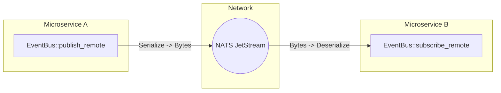

# tokio-events

[](https://crates.io/crates/tokio-events)
[](https://docs.rs/tokio-events)
[](LICENSE)

A modern, type-safe, asynchronous event bus for Rust applications built on `tokio`. 

`tokio-events` scales seamlessly from a simple in-memory pub/sub channel in a monolith, all the way to a strictly-typed, distributed, persistent event architecture across microservices.

## Features

- **Type-safe:** Subscriptions are strictly typed. If you subscribe to `UserCreated`, your handler receives `UserCreated`—no manual downcasting required.
- **Async-First:** Built entirely on `tokio` for massive concurrency and minimal overhead.
- **Progressive Enhancement:** Start with an in-memory bus, and optionally turn on `redb` disk persistence or `NATS JetStream` network routing with 2 lines of config.
- **Strict Schema Enforcement:** (Optional) Natively supports `prost` Protobuf serialization to guarantee zero breaking schema changes across your network.
- **Resilient:** Implements the [Transactional Outbox Pattern](https://microservices.io/patterns/data/transactional-outbox.html), Dead Letter Queues (DLQ), and automatic retries.

## Quick Start (In-Memory JSON)

Add the dependency to your `Cargo.toml`:
```toml
[dependencies]
tokio-events = "0.3.1"
```

Define an event, create the bus, and publish!

```rust
use tokio_events::prelude::*;

// 1. Define your Event (Defaults to JSON serialization)
#[derive(Debug, Clone, serde::Serialize, serde::Deserialize, Event)]
struct UserCreated {
    id: u64,
    email: String,
}

#[tokio::main]
async fn main() -> Result<()> {
    // 2. Build the in-memory Event Bus
    let bus = EventBusBuilder::new().build().await?;

    // 3. Subscribe to the event
    let _handle = bus.subscribe(|event: UserCreated| async move {
        println!("New user registered! Sending email to: {}", event.email);
    }).await?;

    // 4. Publish the event
    bus.publish(UserCreated {
        id: 42,
        email: "alice@example.com".to_string(),
    }).await?;

    Ok(())
}
```

---

## Global Event Bus

You can optionally initialize a globally accessible Event Bus, avoiding the need to pass an `Arc<EventBus>` through all your application layers.

```rust
use tokio_events::global::{set_global_bus, global_bus};

let bus = EventBusBuilder::new().build().await?;
set_global_bus(bus).expect("Failed to set global bus");

// Anywhere else in your code:
let bus = global_bus().expect("Bus not initialized");
bus.publish(MyEvent { id: 1 }).await?;
```

---

## Feature Flags

`tokio-events` uses feature flags to keep your binary size small. 

| Feature | Description | Dependencies |
|---------|-------------|--------------|
| `macros` | (Default) Enables the `#[derive(Event)]` macro. | `tokio-events-macros` |
| `persistence` | Enables embedded `redb` disk persistence for the Outbox Pattern. | `redb` |
| `remote` | Enables distributed network routing via `async-nats` JetStream. | `async-nats` |
| `protobuf` | Enables strict schema enforcement via `prost::Message`. | `prost` |
| `metrics` | Enables internal telemetry metrics. | `metrics` |

---

## Advanced: Disk Persistence (The Outbox Pattern)

If your app crashes immediately after taking payment but before sending the `OrderConfirmed` event, you lose data. `tokio-events` solves this by natively integrating with `redb` (a pure-Rust embedded database).

Enable the feature:
```toml
tokio-events = { version = "0.3.1", features = ["persistence"] }
```

Initialize the bus with disk persistence:
```rust
let bus = EventBusBuilder::new()
    .with_redb_path("events.db")
    // If the server crashes, un-ACK'd events are loaded from disk and replayed on boot!
    .build()
    .await?;
```

---

## Advanced: Distributed Network (NATS JetStream)

Want to route events across microservices? Enable the `remote` feature, derive the `Remote` trait, and `tokio-events` will automatically route your events over NATS JetStream.



Enable the feature:
```toml
tokio-events = { version = "0.3.1", features = ["remote"] }
```

Define the routing topic:
```rust
#[derive(Debug, Clone, serde::Serialize, serde::Deserialize, Event, Remote)]
#[remote(topic = "user.created.v1")] // NATS Topic
struct UserCreated {
    id: u64,
}
```

Publish over the network:
```rust
let bus = EventBusBuilder::new()
    // Connect to NATS JetStream stream "ENTERPRISE_EVENTS"
    .with_nats_jetstream("nats://localhost:4222", "ENTERPRISE_EVENTS", vec!["user.>".to_string()])
    .build()
    .await?;

// This publishes to local subscribers AND the NATS network!
bus.publish_remote(UserCreated { id: 42 }).await?;
```

---

## Advanced: Strict Schema Enforcement (Protobuf)

When 10 microservices share events over NATS, changing a JSON field name can cause cascading outages (Poison Pills). `tokio-events` supports native Protobuf serialization to guarantee schema safety.

Enable the feature:
```toml
tokio-events = { version = "0.3.1", features = ["protobuf", "remote"] }
```

Tag your struct with `#[event(format = "protobuf")]`:
```rust
#[derive(Clone, PartialEq, prost::Message, Event, Remote)]
#[event(format = "protobuf")] // The macro injects strict prost serialization!
#[remote(topic = "user.protobuf.v1")]
struct UserUpdated {
    #[prost(uint64, tag = "1")]
    pub id: u64,
    #[prost(string, tag = "2")]
    pub email: String,
}
```
Now, `bus.publish_remote(event)` will emit highly optimized binary Protobuf bytes over the network instead of JSON!
