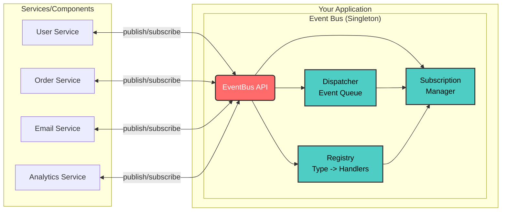
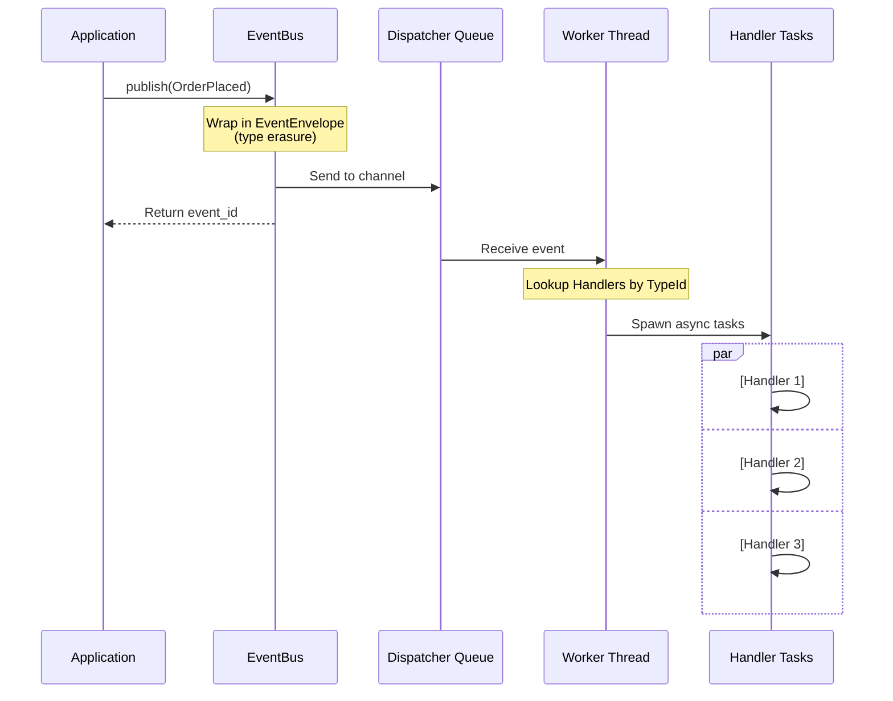

# tokio-events Usage Guide

## Table of Contents
1. [High Level Architecture](#high-level-architecture)
2. [Event Flow](#event-flow)
3. [Getting Started](#getting-started)
4. [Core Concepts](#core-concepts)
5. [API Reference](#api-reference)

---

## High Level Architecture

`tokio-events` provides a clean separation of concerns, allowing your microservices and components to communicate purely through typed events.



---

## Event Flow

When you publish an event, `tokio-events` handles the routing, queueing, and asynchronous execution in the background:



---

## Getting Started

### Installation

Add to your `Cargo.toml`:
```toml
[dependencies]
tokio-events = "0.3.2"
tokio = { version = "1.0", features = ["full", "time"] }
```

### Basic Example

```rust
use tokio_events::prelude::*;

// 1. Define your event using the macro
#[derive(Debug, Clone, serde::Serialize, serde::Deserialize, Event)]
struct UserRegistered {
    user_id: u64,
    email: String,
}

#[tokio::main]
async fn main() -> Result<()> {
    // 2. Create the event bus using the Builder
    let bus = EventBusBuilder::new().build().await?;
    
    // 3. Subscribe to events
    let handle = bus.subscribe(|event: UserRegistered| async move {
        println!("New user: {} with id {}", event.email, event.user_id);
    }).await?;
    
    // 4. Publish events
    bus.publish(UserRegistered {
        user_id: 123,
        email: "user@example.com".to_string(),
    }).await?;
    
    // Wait for async processing
    tokio::time::sleep(tokio::time::Duration::from_millis(100)).await;
    
    // 5. Cleanup
    bus.unsubscribe(handle).await?;
    bus.shutdown().await?;
    
    Ok(())
}
```

---

## Core Concepts

### Events
Events are simple data structures that implement the `Event` trait. With the `macros` feature (enabled by default), you can simply `#[derive(Event)]`:

```rust
use tokio_events::prelude::*;

#[derive(Debug, Clone, serde::Serialize, serde::Deserialize, Event)]
struct OrderPlaced {
    order_id: u64,
    customer_id: u64,
    total_amount: f64,
}
```

### Global Event Bus
Instead of passing `Arc<EventBus>` through all layers of your application, you can use the Global Event Bus:

```rust
use tokio_events::global::{set_global_bus, global_bus};

// Initialize once
let bus = EventBusBuilder::new().build().await?;
set_global_bus(bus).expect("Failed to set global bus");

// Access anywhere
let bus = global_bus().expect("Bus not initialized");
bus.publish(OrderPlaced { ... }).await?;
```

---

## API Reference

### EventBus Creation

#### `EventBusBuilder::new().build()`
Creates a new builder for configuring the EventBus.

#### Presets
- `EventBusBuilder::new().high_throughput()`: 50k queue size, multiple workers. Best for massive traffic.
- `EventBusBuilder::new().reliable()`: Best for critical data. Configured for retries.
- `EventBusBuilder::new().ordered()`: Single worker thread. Ensures FIFO ordering.

### Publishing Events

#### `publish<T: Event>(&self, event: T) -> Result<Uuid>`
Publishes an event and immediately returns its unique ID.

#### `publish_with_metadata<T: Event>(&self, event: T, metadata: EventMetadata) -> Result<Uuid>`
Publishes an event with custom metadata, such as a correlation ID or a scheduled delay:

```rust
let correlation_id = Uuid::new_v4();
let metadata = EventMetadata::new()
    .set_correlation_id(correlation_id)
    .delay_by(std::time::Duration::from_secs(60)); // Delay processing by 1 minute!

bus.publish_with_metadata(OrderPlaced { ... }, metadata).await?;
```

### Subscribing to Events

#### `subscribe<T, F, Fut>(&self, handler: F) -> Result<SubscriptionHandle>`
Subscribes an asynchronous closure to handle events of type `T`.

```rust
let handle = bus.subscribe(|event: OrderPlaced| async move {
    println!("Order {} placed for ${}", event.order_id, event.total_amount);
}).await?;
```

When you are done listening for events, use `bus.unsubscribe(handle).await?;`. If a `SubscriptionHandle` is dropped from scope, the subscription is automatically terminated.